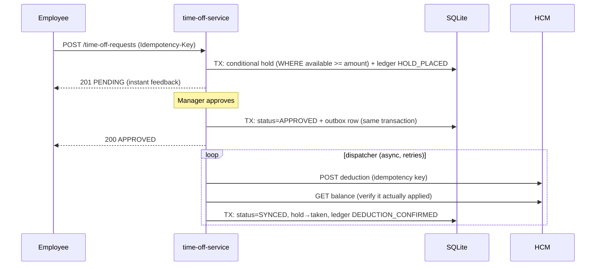
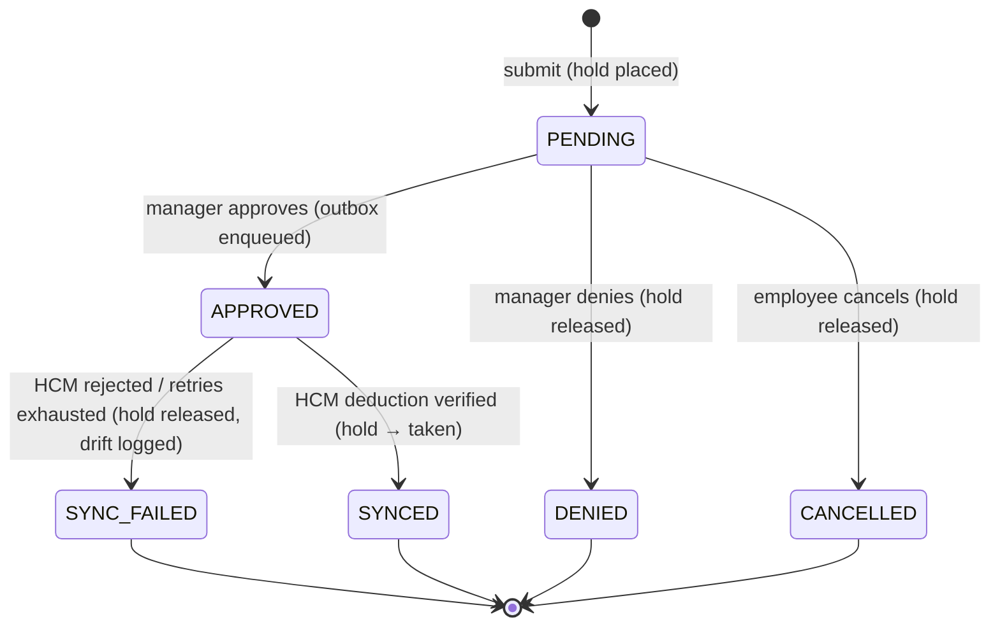

# Technical Requirements Document — Time-Off Microservice

**System:** ReadyOn Time-Off Microservice
**Status:** Approved
**Stack:** NestJS · TypeScript · SQLite (better-sqlite3, WAL) · TypeORM

---

## 1. Context & Problem Statement

ReadyOn is the primary interface where employees request time off, but the customer's
HCM system (Workday, SAP, etc.) remains the **source of truth** for employment data,
including time-off balances. Balances are tracked **per employee, per location**.

Keeping the two systems consistent is hard for three reasons:

1. **ReadyOn is not the only writer.** HCM balances change out-of-band — work-anniversary
   bonuses, start-of-year refreshes, HR corrections.
2. **HCM integration surface is limited.** HCM exposes (a) a realtime API to get/set a
   single balance value and (b) a batch endpoint that ships the whole balance corpus.
3. **HCM error behavior is not guaranteed.** HCM *usually* rejects deductions against
   invalid dimensions or insufficient balance — but we cannot rely on it. A request may
   return `200 OK` and silently not apply. The service must be defensive.

**Personas:** the *Employee* needs an accurate balance and instant feedback on requests;
the *Manager* needs to approve requests knowing the data is valid.

## 2. Goals & Non-Goals

### Goals
- Manage the full lifecycle of a time-off request (submit → approve/deny/cancel → synced).
- Give employees instant, accurate feedback without a blocking round-trip to HCM.
- Guarantee **balance integrity**: never double-deduct, never go negative, never silently
  lose a deduction.
- Absorb out-of-band HCM balance changes via batch reconciliation without corrupting
  in-flight requests.
- Be defensive against every HCM failure mode: down, slow, erroring, and *lying*.
- Provide a complete audit trail of every balance movement.

### Non-Goals
- Authentication/authorization (assume an upstream gateway supplies identity; endpoints
  take employee/manager IDs as inputs).
- Multi-day accrual policies, carry-over rules, or leave-type taxonomies (balances are a
  single number of days per employee+location, per the exercise).
- Horizontal scaling / multi-writer database concerns (SQLite is mandated; §10 notes what
  changes for Postgres).
- A frontend.

## 3. Key Challenges

| # | Challenge | Where addressed |
|---|-----------|-----------------|
| C1 | HCM balance changes out-of-band (anniversary, yearly refresh) | §7 batch reconciliation, hold-aware merge |
| C2 | Instant feedback without trusting a remote system on the hot path | §5 local projection + holds |
| C3 | HCM may not reject invalid/insufficient requests | §8 defensive design: local pre-validation |
| C4 | HCM may fail silently (2xx without effect) or be unreachable | §7 outbox + read-after-write verification |
| C5 | Retries and duplicate submissions must not double-deduct | §8 idempotency keys, atomic conditional writes |
| C6 | Future development must not regress balance integrity | §9 invariant-based test fence |

## 4. Architecture Overview

Monorepo with two NestJS applications:

```
apps/time-off-service        ← the microservice (this TRD's subject)
apps/mock-hcm                ← standalone mock HCM with chaos modes (test infrastructure)
```

### Modules of `time-off-service`

| Module | Responsibility |
|---|---|
| `requests` | Time-off request lifecycle state machine; the only writer of holds |
| `balances` | Balance projection (read model); answers "what is available right now" |
| `ledger` | Append-only record of every balance movement; audit + invariant anchor |
| `hcm-sync` | HCM client, transactional outbox dispatcher, batch reconciliation. **The only module that talks to HCM** |

Isolating all HCM I/O in `hcm-sync` means every other module is pure local logic —
deterministic, fast to test, and immune to HCM contract drift.

### Happy-path data flow



## 5. Data Model

All balance state lives in four tables. `available` is always
`accrued_baseline − taken − pending_holds`.

```sql
-- Projection: current truth as this service understands it
CREATE TABLE balances (
  employee_id      TEXT NOT NULL,
  location_id      TEXT NOT NULL,
  accrued_baseline REAL NOT NULL DEFAULT 0,  -- owned by HCM, replaced on sync
  pending_holds    REAL NOT NULL DEFAULT 0,  -- owned by this service
  taken            REAL NOT NULL DEFAULT 0,  -- confirmed deductions
  last_synced_at   TEXT,
  PRIMARY KEY (employee_id, location_id)
);

CREATE TABLE time_off_requests (
  id              TEXT PRIMARY KEY,
  employee_id     TEXT NOT NULL,
  location_id     TEXT NOT NULL,
  amount_days     REAL NOT NULL CHECK (amount_days > 0),
  status          TEXT NOT NULL,             -- see state machine
  idempotency_key TEXT NOT NULL UNIQUE,
  manager_id      TEXT,
  failure_reason  TEXT,
  created_at      TEXT NOT NULL,
  updated_at      TEXT NOT NULL
);

-- Append-only. Never updated, never deleted.
CREATE TABLE ledger (
  id            INTEGER PRIMARY KEY AUTOINCREMENT,
  employee_id   TEXT NOT NULL,
  location_id   TEXT NOT NULL,
  entry_type    TEXT NOT NULL,  -- HOLD_PLACED | HOLD_RELEASED | DEDUCTION_CONFIRMED
                                -- | ACCRUAL_SYNC | RECONCILIATION_ADJUSTMENT
  amount        REAL NOT NULL,  -- signed delta to `available`
  balance_after REAL NOT NULL,  -- available after applying this entry
  request_id    TEXT,           -- nullable FK to time_off_requests
  detail        TEXT,           -- JSON context (e.g., drift explanation)
  created_at    TEXT NOT NULL
);

CREATE TABLE outbox (
  id              TEXT PRIMARY KEY,
  request_id      TEXT NOT NULL,
  operation       TEXT NOT NULL,             -- DEDUCT | REFUND
  payload         TEXT NOT NULL,             -- JSON
  idempotency_key TEXT NOT NULL UNIQUE,
  status          TEXT NOT NULL,             -- PENDING | SENT | VERIFIED | FAILED
  attempts        INTEGER NOT NULL DEFAULT 0,
  next_retry_at   TEXT,
  last_error      TEXT,
  created_at      TEXT NOT NULL
);
```

### Core invariants

For every `(employee_id, location_id)` at all times:

- **I1:** `SUM(ledger.amount) == balances.available` (ledger is the anchor; the
  projection is a cache of it)
- **I2:** `available >= 0`
- **I3:** at most one ledger `HOLD_PLACED` (without matching release) and at most one
  `DEDUCTION_CONFIRMED` per request — no double-spend

These invariants are enforced in code (single service path mutates balances, always
inside a transaction that writes the ledger entry and projection together) and **asserted
by the property-based test suite** (§9).

## 6. Request Lifecycle (State Machine)



Any transition not in this diagram returns `409 INVALID_TRANSITION`. Transitions are
implemented as an explicit table (from-state, action) → to-state, which the unit suite
covers edge-by-edge — including all illegal edges.

**Why deduct on approval, not on submit:** a submitted request is an intent, not a
commitment; pushing it to HCM early would require compensating writes on every
deny/cancel, multiplying the failure surface. The local hold gives the employee instant,
accurate feedback (their `available` drops immediately) while HCM is only mutated once
the request is real. Trade-off: a window where ReadyOn shows a lower balance than HCM —
acceptable, because ReadyOn's number is the *conservative* one.

## 7. HCM Synchronization

### 7.1 Outbound writes — transactional outbox

Approval writes the status change **and** an outbox row in the same SQLite transaction.
A background dispatcher (NestJS interval scheduler) processes outbox rows:

1. `POST` the deduction to the HCM realtime API with the row's idempotency key.
2. **Verify:** `GET` the balance back and confirm the deduction applied. A `2xx`
   response is *not* trusted on its own (challenge C4 — silent failures).
3. On verified success: mark `VERIFIED`, transition request to `SYNCED`, convert hold to
   `taken`, append `DEDUCTION_CONFIRMED`.
4. On failure: exponential backoff with jitter (`1s · 2^attempts`, capped), max 8
   attempts. On exhaustion or explicit HCM rejection: request → `SYNC_FAILED`, hold
   released (`HOLD_RELEASED`), drift logged (`RECONCILIATION_ADJUSTMENT` with detail),
   surfaced in the drift report for manager action.

**Why not call HCM synchronously during approval:** a synchronous call couples approval
availability to HCM availability, and a timeout leaves the system *not knowing* whether
HCM deducted — the worst possible state. The outbox makes approval always succeed
locally, makes retries safe (idempotency key), and converts "unknown" into "verified or
retried". Trade-off accepted: HCM consistency is eventual (seconds), and there are more
moving parts; both are documented and tested.

### 7.2 Inbound sync — batch reconciliation (hold-aware merge)

A scheduled job (and `POST /sync/batch` for on-demand/webhook use) ingests the HCM batch
corpus. Per `(employee, location)`:

1. The batch value **replaces `accrued_baseline`** — HCM is the source of truth for
   accruals (anniversary bonuses, yearly refresh arrive this way: challenge C1).
2. Local `pending_holds` are **re-applied on top** — in-flight requests survive.
3. `ACCRUAL_SYNC` ledger entry records the baseline delta. If the implied `available`
   differs from what the ledger predicts (unexplained drift), a
   `RECONCILIATION_ADJUSTMENT` entry records the discrepancy and it appears in
   `GET /admin/reconciliation/drift`.
4. If the new baseline makes `available` negative (HCM clawed back days already held),
   the balance floors the projection at the true value, flags affected `PENDING`
   requests, and reports them as drift — it does not auto-cancel; that's a human call.

**Why not blind overwrite:** the batch snapshot doesn't know about ReadyOn's pending
holds; overwriting would briefly re-inflate `available` and open a double-booking window.
**Why not flag-everything-for-review:** every legitimate accrual would page a human;
useless at scale. The merge keeps each side authoritative for what it owns: HCM owns
accruals, this service owns holds.

## 8. Defensive Design

Numbered, because the test suite references them:

- **D1 — Never trust HCM to reject.** Every mutation is pre-validated against the local
  projection (`available >= amount`, dimensions exist) *before* anything is sent.
- **D2 — Never trust HCM to succeed.** Every write is verified with a follow-up read
  (§7.1). An unverified `200` is a failure.
- **D3 — Retries are always safe.** Idempotency keys on our API (`Idempotency-Key`
  header, unique column) and on HCM writes (outbox key). Replays return the original
  result; they never re-execute.
- **D4 — No lost updates.** Holds are placed with an atomic conditional
  `UPDATE … SET pending_holds = pending_holds + :amt WHERE available >= :amt`
  (affected-rows check) inside a transaction. SQLite's serialized writer makes this
  race-free. *(Why not optimistic version columns or per-employee queues: more machinery
  than a serialized-writer DB needs; §10 notes the Postgres equivalent.)*
- **D5 — Failures are visible, not silent.** Exhausted retries and reconciliation drift
  land in the ledger and the drift report endpoint, never in a log line alone.

## 9. API Specification

All errors use `application/problem+json` with enumerated codes:
`INSUFFICIENT_BALANCE`, `INVALID_DIMENSIONS`, `DUPLICATE_REQUEST`,
`INVALID_TRANSITION`, `HCM_UNAVAILABLE`, `NOT_FOUND`, `VALIDATION_FAILED`.

| Method & Path | Description | Notable responses |
|---|---|---|
| `POST /time-off-requests` | Submit request. Requires `Idempotency-Key` header. Body: `employeeId, locationId, amountDays` | `201` PENDING · `422 INSUFFICIENT_BALANCE` · `422 INVALID_DIMENSIONS` · `200` original on duplicate key |
| `GET /time-off-requests/:id` | Request detail incl. status + failure reason | `200` · `404` |
| `GET /time-off-requests?employeeId=&locationId=&status=` | Filtered list | `200` |
| `POST /time-off-requests/:id/approve` | Manager approval. Body: `managerId` | `200` APPROVED · `409 INVALID_TRANSITION` |
| `POST /time-off-requests/:id/deny` | Manager denial; releases hold | `200` · `409` |
| `POST /time-off-requests/:id/cancel` | Employee cancel; PENDING only | `200` · `409` |
| `GET /balances/:employeeId/:locationId` | Projection + `lastSyncedAt`. `?verify=true` adds a live HCM cross-check and reports any mismatch | `200` · `404` |
| `POST /sync/batch` | Trigger batch ingestion (also on cron) | `202` with reconciliation summary |
| `GET /admin/reconciliation/drift` | All unexplained drift entries | `200` |
| `GET /health` | Liveness + HCM reachability | `200` / `503` |

## 10. Alternatives Considered

### Macro-architecture

| Option | Description | Why not / why yes |
|---|---|---|
| **A — Pass-through proxy** | Thin layer over the HCM realtime API; no local state | Simplest possible. Fails the core requirements: no instant feedback (every read is a remote call), nothing works when HCM is down, and it inherits HCM's unreliable error behavior with no defense. Rejected. |
| **B — Local projection + holds + reconciliation** (no ledger) | The chosen architecture minus the audit ledger | Functionally sufficient, smaller schema. But the ledger is what makes balance integrity *provable*: invariant I1 gives the test suite a second, independent derivation of every balance to check the projection against. Rejected for losing the strongest regression fence. |
| **B + ledger** ✅ | Projection for speed, append-only ledger for truth | **Chosen.** The ledger costs one insert per mutation and buys auditability, drift forensics, and the I1 invariant. |
| **C — Full event sourcing** | Events are the only store; all state derived | Strongest audit story, but rebuild-on-read complexity, snapshotting, and event versioning are heavy for a take-home reviewer to evaluate — and for this domain the ledger achieves the same auditability at a fraction of the cost. Rejected as over-engineering. |

### Sub-decisions

| Decision | Chosen | Alternatives & why rejected |
|---|---|---|
| API style | REST | GraphQL: resolver/schema overhead with no consumer demanding flexible queries; lifecycle actions (`approve`, `deny`) map naturally to REST verbs on resources. |
| Deduction timing | On approval | On submit: requires compensating HCM writes on every deny/cancel; multiplies failure surface (§6). |
| HCM write delivery | Transactional outbox + verification | Synchronous call: couples approval to HCM uptime; timeout = unknown outcome (§7.1). |
| Concurrency control | Atomic conditional UPDATE + idempotency keys | Optimistic versioning / per-employee queues: unnecessary machinery on a serialized-writer DB. On Postgres, the same logic becomes `SELECT … FOR UPDATE` or stays as a conditional UPDATE — the service interface doesn't change. |
| Reconciliation policy | Hold-aware merge | Blind overwrite: double-booking window. Flag-everything: drowns humans in legitimate accruals (§7.2). |

## 11. Testing Strategy

The exercise is graded on test rigor; the strategy is built around **fencing the
invariants**, not chasing line coverage.

| Layer | Tooling | What it fences |
|---|---|---|
| Unit | Jest | State machine: every legal *and illegal* transition edge; balance arithmetic; reconciliation merge logic. Pure, no I/O. |
| Integration | Jest + real SQLite (no DB mocks) | D3/D4: concurrent submits can't oversubscribe a balance; idempotency-key replays return originals; approval writes outbox row atomically; ledger append correctness. |
| Property-based | fast-check | I1/I2/I3 under randomized interleavings of submit/approve/deny/cancel/batch-sync, checked against a simple reference model after every operation. Finds the bugs nobody writes an example test for. |
| E2E | supertest + real `mock-hcm` process | Full lifecycle happy paths **plus chaos scenarios**: HCM timeout, 500s, silent failure (200 without effect → D2 verification catches it), out-of-band balance change mid-approval, batch arriving while holds are pending. |
| Mutation | StrykerJS on the service layer | Proves the suite kills regressions; mutation score reported in README. |
| CI | GitHub Actions | lint → unit+integration → e2e → coverage gate. The uploaded coverage report is the proof-of-coverage deliverable. |

### Mock HCM (`apps/mock-hcm`)

A real deployable NestJS app, not an in-process stub — so e2e tests exercise actual HTTP
behavior (timeouts, connection errors).

- Functional: `GET /balances/:employeeId/:locationId`, `POST /deductions`, `GET /batch`
- Control plane (used by tests): `POST /admin/balances` (seed/mutate out-of-band),
  `POST /chaos/mode` — modes: `timeout`, `error500`, `silent-failure` (accepts the
  deduction, returns 200, doesn't apply it), `reject-insufficient`, `healthy`

## 12. Risks & Future Work

- **SQLite single-writer:** fine at exercise scale; production would move to Postgres
  (D4 maps to `FOR UPDATE`/conditional UPDATE; outbox pattern unchanged).
- **Dispatcher is in-process:** a crash between SENT and VERIFIED is recovered on
  restart by re-verifying (idempotency key makes the retry safe), but a dedicated queue
  (e.g., BullMQ) would be the production shape.
- **`SYNC_FAILED` resolution is manual** via the drift report; an auto-retry/escalation
  policy is future work.
- **Auth** is delegated to the gateway; production would enforce manager/employee roles.
